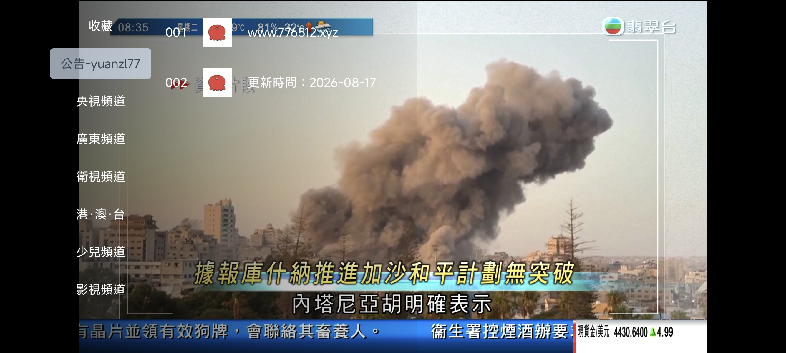
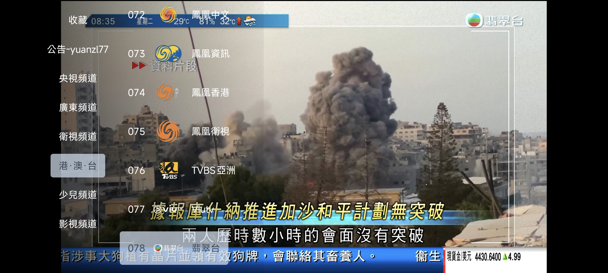

# IPTV 直播源

自动聚合全网 IPTV 直播源，每日更新，支持 M3U / TXT 格式，可直接用于 TVBox、风萤影视、Kodi 等播放器。

> **声明：** 所有播放源均收集于互联网，仅供测试研究学习，**不得商用**。

---




## 在线地址

| 线路 | 地址 |
|------|------|
| 直连 | https://live.776512.xyz/yuanzl77 |
| M3U | https://cdn.jsdelivr.net/gh/yuanzl77/IPTV@latest/live.m3u |
| TXT | https://cdn.jsdelivr.net/gh/yuanzl77/IPTV@latest/live.txt |

> CDN 加速：https://github.776512.xyz/https://raw.githubusercontent.com/yuanzl77/IPTV/main/live.m3u

---

## 功能特性

- **自动聚合**：从多个数据源抓取频道，按频道名精确匹配汇总
- **IPv4 / IPv6 双栈**：优先使用 IPv6 地址（可配置）
- **质量检测**：aiohttp 并发测活，自动过滤失效源（可选关闭）
- **黑名单建议**：每次运行后打印频繁失败的域名，方便手动加入黑名单
- **EPG 电子节目单**：M3U 头部内置多组 EPG 地址，支持 TiviMate、Kodi 等播放器
- **公告支持**：可在直播源头部插入公告条目，支持自动日期占位符
- **每日自动更新**：GitHub Actions 定时任务，每天 05:55 自动推送

---

## 本地运行

```bash
pip install requests aiohttp
python main.py
```

输出文件：
- `live.m3u` — M3U 格式（含 EPG，带台标）
- `live.txt` — TXT 格式（TVBox / 风萤直接使用）
- `function.log` — 运行日志，含黑名单建议

本地播放建议搭配[iptv-checker](https://github.com/zhimin-dev/iptv-checker)
实现个人环境高质量播放体验
---

## 配置说明

所有配置在 `config.py` 中修改：

```python
# IP 优先级：ipv6 或 ipv4
ip_version_priority = "ipv6"

# 数据源列表（支持 m3u / txt 格式）
source_urls = [ ... ]

# URL 黑名单（包含任意子串的地址会被过滤）
url_blacklist = [ ... ]

# 公告条目（写在直播源头部）
announcements = [ ... ]

# EPG 地址列表
epg_urls = [ ... ]

# 质量检测开关
enable_quality_check = True    # True=检测，False=跳过
check_timeout = 5.0            # 单个 URL 超时（秒）
check_max_conn = 50            # 最大并发数
```


---

## IPv6 优势

1. **更低延迟**：减少视频缓冲和加载时间
2. **更好的组播支持**：更高效地传输视频内容
3. **更稳定**：避免 IPv4/IPv6 地址转换带来的连接中断

查看当前网络是否支持 IPv6：[test-ipv6.com](https://test-ipv6.com/index.html.zh_CN)
